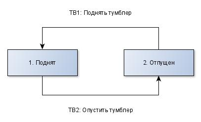

# Лабораторная работа №5
Прибор: чайник

### 1. Информационная модель

### 2. ДПС (Диаграмма перехода состояний)
Вилка:   
  

Датчик:   
  

Крышка:   
  

Нагреватель:   
  

Тумблер:   
  

Чайник:   
  

# 3. МВО (Модель Взаимодействия Объектов)
  

# 4. ДПДД (на примере нагревателя)
  
